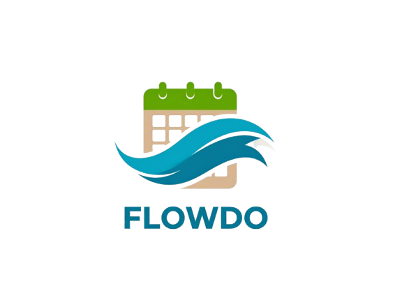

# 📱 FlowDo 

FlowDo is a minimalist productivity app inspired by the "Getting Things Done" (GTD) framework. Designed for task clarity and mental flow, it helps you capture ideas, organize them into projects, and take action with context-aware planning.



---

## 🚀 Demo Links

- 📱 **Expo Preview (for testing)**: [Try on Expo Go](https://expo.dev/preview/update?message=Initial%20publish%20of%20FLOWDO%20App&updateRuntimeVersion=1.0.0&createdAt=2025-06-19T16%3A36%3A17.761Z&slug=exp&projectId=503bec3b-0709-446e-bae4-5250be8e4497&group=09b767d7-1954-4a7a-9afd-3ef447caa6fc)
- 📦 **APK Download (Android)**: [Download APK](https://expo.dev/accounts/rahul0032/projects/FlowDo/builds/4cb996c5-e9e3-4737-b902-32d004f5e69c)

---

## 🧠 Features

### ✔ Capture (Inbox)
- Quickly jot down new tasks or ideas
- Tasks added without structure land in the Inbox for later processing

### 📂 Organize (Projects & Contexts)
- Create and assign tasks to **Projects**
- Define actionable tasks as **Next Actions**
- Organize Next Actions by **Context** (e.g., @home, @work, @calls)

### 🎯 Engage (Next Actions View)
- View all active Next Actions
- Filter by **Project** or **Context**
- Mark tasks as complete with a single tap

### 🌓 UI & UX
- Clean, distraction-free interface
- Modern color theme based on brand palette
- Light/Dark mode 
- Smooth transitions and empty-state illustrations

---

## 🧱 Tech Stack

| Layer       | Tech                     |
|-------------|--------------------------|
| Frontend    | React Native with Expo   |
| State Mgmt  | React Context API        |
| Storage     | AsyncStorage (local)     |
| Icons       | Expo Vector Icons        |
| UI Libs     | Native Base / Custom CSS |

---

## 📦 Installation & Running Locally

### Requirements
- Node.js ≥ 16.x
- Expo CLI (`npm install -g expo-cli`)
- Expo Go App (on your mobile device)

### Steps

```bash
git clone https://github.com/RAHULDINDIGALA-32/Personal-Productivity-Mobile-App.git
cd Personal-Productivity-Mobile-App
cd App
npm install
npx expo start
